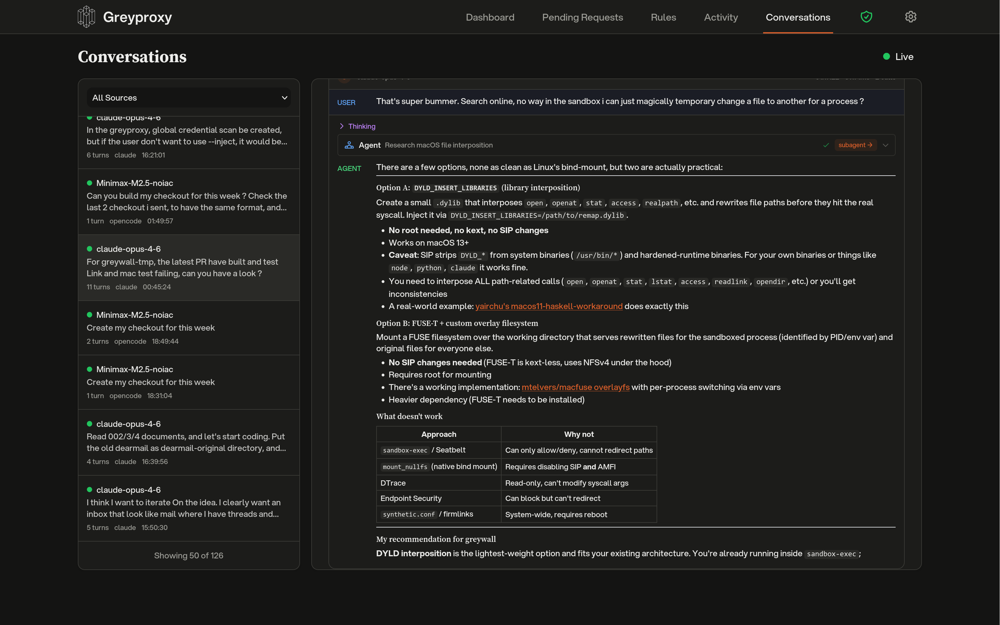

# LLM Conversation Tracking



Greyproxy can intercept traffic to popular LLM APIs and reconstruct it into structured conversations. When enabled, requests to providers such as Anthropic, OpenAI, and Google Gemini are parsed into messages, tool calls, and assistant responses, then grouped by client and displayed in the dashboard.

Conversation tracking is enabled by default and requires MITM (HTTPS interception) to be active, since most LLM APIs use TLS.

## What you get

Once traffic is flowing through greyproxy with the CA certificate trusted, the **Conversations** tab in the dashboard shows each LLM session with:

- The coding tool or client that generated the traffic (for example Claude Code, Codex, Aider, OpenCode, Gemini CLI)
- The model used for each turn
- System prompt, user messages, assistant responses, and tool invocations
- Subagent threads spawned by the main agent (where supported)
- Token counts and timing information

Sessions are grouped automatically using client-specific strategies; a single Claude Code run, for example, appears as one conversation even though it performs many HTTP requests under the hood.

## Supported providers and formats

Each built-in dissector handles a specific API shape. The decoder name is what you use when creating an endpoint rule.

| Decoder | Endpoint | Typical clients |
|---------|----------|-----------------|
| `anthropic` | `POST /v1/messages` on `api.anthropic.com` | Claude Code, Anthropic SDK |
| `openai` | `POST /v1/responses` on `api.openai.com` | Codex CLI (HTTP mode) |
| `openai-ws` | `WS /v1/responses` on `api.openai.com` | Codex CLI (WebSocket mode) |
| `openai-chat` | `POST /v1/chat/completions` on any host | Aider, OpenCode, LiteLLM, Ollama, vLLM, OpenRouter |
| `google-ai` | `POST /v1beta/models/*` on `generativelanguage.googleapis.com` | Gemini CLI, Google AI SDK |

The `openai-chat` decoder is the most common choice for self-hosted models and OpenAI-compatible proxies.

## Adding custom endpoints

If you run an LLM behind a custom hostname (an internal LiteLLM gateway, an Ollama server, a self-hosted vLLM deployment, and so on), you can tell greyproxy which decoder to use.

### From the dashboard

Open **Settings**, expand **Conversations**, and click **Add Endpoint Rule**. You will need:

- **Host pattern**: hostname of your endpoint, for example `litellm.local:4000`. Supports `*` as a wildcard (for example `*.internal.company.com`).
- **Path pattern**: URL path, for example `/v1/chat/completions`. Wildcards also supported.
- **Method**: usually `POST`.
- **Decoder**: which dissector to apply. Choose `openai-chat` for most self-hosted or custom endpoints.

After adding a rule, click **Rebuild** to reprocess previously stored traffic with the new rule.

### From the REST API

```bash
curl -X POST http://localhost:43080/api/endpoint-rules \
  -H 'Content-Type: application/json' \
  -d '{
    "host_pattern": "litellm.local:4000",
    "path_pattern": "/v1/chat/completions",
    "method": "POST",
    "decoder_name": "openai-chat",
    "priority": 10,
    "enabled": true
  }'

# List all rules (built-in + custom)
curl http://localhost:43080/api/endpoint-rules

# Delete a user-defined rule
curl -X DELETE http://localhost:43080/api/endpoint-rules/42

# Trigger a rebuild after changing rules
curl -X POST http://localhost:43080/api/maintenance/rebuild-conversations
```

## Auto-detection

If you forget to add a rule, the assembler tries to auto-detect OpenAI-compatible endpoints. When a POST to an unknown host contains a request body with `model` and `messages` fields, greyproxy creates an `openai-chat` endpoint rule on the fly and processes the transaction. Auto-created rules show up alongside user-defined ones in the settings panel.

## Client detection

Greyproxy identifies which coding tool generated the traffic using a priority chain:

1. Container name from greywall (when available), mapped against a known client lookup table.
2. HTTP headers such as `User-Agent` or `X-Title`.
3. Client hints embedded in the request (for example Codex's WebSocket metadata).
4. Adapter fingerprinting based on extracted system prompt content, tool names, and request structure.
5. Provider fallback, which uses the dissector's provider name as a generic client identifier.

Each client adapter decides how transactions should be grouped into sessions, and how to classify each turn as main, subagent, utility, or title-generation.

## Disabling conversation tracking

You can turn off conversation tracking globally from the dashboard (Settings > Conversations) or via the settings API:

```bash
curl -X PUT http://localhost:43080/api/settings \
  -H 'Content-Type: application/json' \
  -d '{"conversationsEnabled": false}'
```

When disabled, HTTP transactions are still recorded, but the assembler is bypassed and no conversation rows are created.

## Pattern syntax

Host and path patterns use simple glob matching. Only `*` is special (it matches any sequence of characters); there is no regex support. Examples: `*.example.com`, `/v1/*/completions`, `api.openai.com`.
