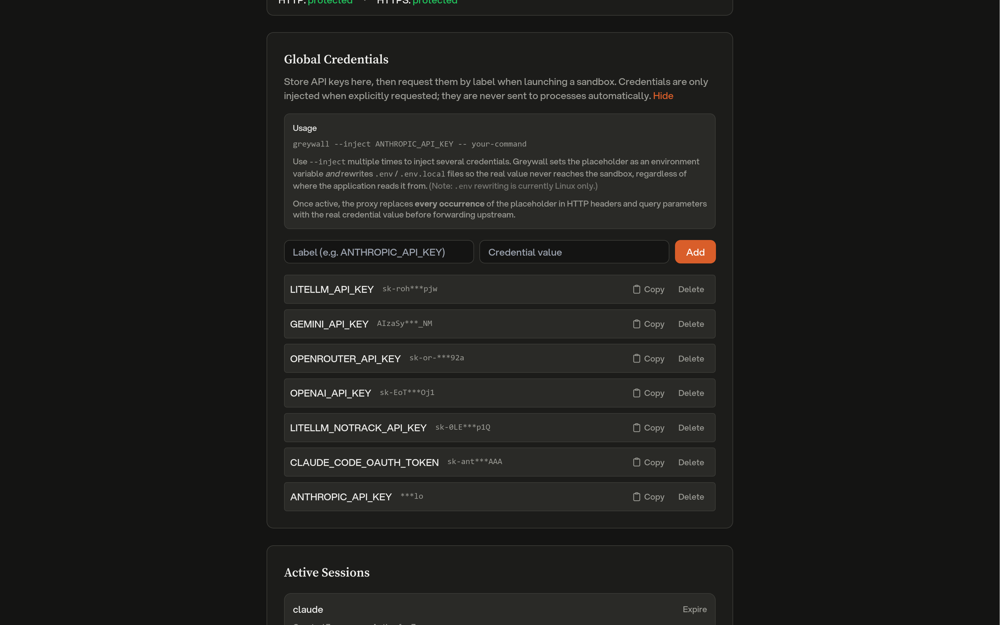

# Credential Substitution



Greyproxy can transparently inject real API keys into outgoing requests while the sandboxed process only ever sees opaque placeholders. This lets you run AI coding tools or other scripts inside greywall without exposing real credentials to the sandbox, and without modifying the tool itself.

```
 Sandbox                         Greyproxy                        Upstream
+--------+                      +-----------+                    +---------+
|  App   | -- Bearer <ph> ----> | substitute| -- Bearer <real> ->|   API   |
+--------+                      +-----------+                    +---------+
```

The sandboxed process never sees the real key; greyproxy holds the mapping in memory and performs the swap at the MITM layer, after the transaction headers have been cloned for storage. The dashboard therefore shows the placeholder, never the real secret.

## Two kinds of credentials

Greyproxy supports two different credential flows.

### Session credentials

When greywall launches a sandbox, it scans the process environment for credential-like variables (API keys, tokens, and similar), generates opaque placeholder strings, and registers a session with greyproxy. The placeholders are passed into the sandbox as environment variables in place of the real values. Session credentials live only as long as the session, and they are wiped from memory when the session expires or is deleted.

### Global credentials

Global credentials are stored persistently in the greyproxy dashboard under **Settings > Credentials**. They are encrypted at rest with a per-installation key and never leave greyproxy's process memory unencrypted. Global credentials are not injected automatically; greywall must request them explicitly using the `--inject` flag.

```bash
greywall --inject ANTHROPIC_API_KEY -- opencode
```

At session creation time, greywall sends the list of requested labels and greyproxy responds with their placeholders. Greywall then sets those placeholders as environment variables in the sandbox.

## Managing global credentials

### From the dashboard

Open **Settings > Credentials**, click **Add credential**, and provide a label (typically the environment variable name) and the real value. The value is encrypted before being written to disk. Use the copy button next to a credential to get its placeholder string, which you can reference from `greywall --inject`.

### From the REST API

```bash
# List stored credentials (labels and placeholders only, never the real value)
curl http://localhost:43080/api/credentials

# Add a credential
curl -X POST http://localhost:43080/api/credentials \
  -H 'Content-Type: application/json' \
  -d '{"label": "ANTHROPIC_API_KEY", "value": "sk-ant-real-secret"}'

# Delete a credential
curl -X DELETE http://localhost:43080/api/credentials/42
```

## Session API

The session endpoints are what greywall (or any other sandbox client) calls to register credentials for a running process.

### Create or update a session

```http
POST /api/sessions
```

```json
{
  "session_id": "gw-abc123",
  "container_name": "opencode",
  "mappings": {
    "greyproxy:credential:v1:gw-abc123:aabb...": "sk-real-key"
  },
  "labels": {
    "greyproxy:credential:v1:gw-abc123:aabb...": "ANTHROPIC_API_KEY"
  },
  "global_credentials": ["OPENAI_API_KEY"],
  "metadata": {
    "pwd": "/home/user/project",
    "cmd": "opencode",
    "pid": "12345"
  },
  "ttl_seconds": 900
}
```

| Field | Required | Description |
|-------|----------|-------------|
| `session_id` | yes | Unique identifier (UUID recommended). Used for upserts. |
| `container_name` | yes | Process or container name, shown in the dashboard and used for log correlation. |
| `mappings` | one of | Map of placeholder to real value, for credentials the caller generated locally. |
| `global_credentials` | one of | List of global credential labels to resolve into this session. |
| `labels` | no | Map of placeholder to human-readable label, used for display. |
| `metadata` | no | Free-form key/value pairs describing the sandboxed process. |
| `ttl_seconds` | no | Session lifetime in seconds. Default 900, maximum 3600. |

Either `mappings` or `global_credentials` (or both) must be provided. The response contains the resolved placeholders for any global credentials that were requested:

```json
{
  "session_id": "gw-abc123",
  "expires_at": "2026-04-10T23:15:00Z",
  "credential_count": 2,
  "global_credentials": {
    "OPENAI_API_KEY": "greyproxy:credential:v1:global:ccdd..."
  }
}
```

### Heartbeat

```http
POST /api/sessions/:id/heartbeat
```

Resets the TTL of an existing session. Returns 404 if the session has already expired, in which case greywall will re-register.

### Delete and list

```http
DELETE /api/sessions/:id
GET    /api/sessions
```

`DELETE` immediately removes the session and its credentials from memory. `GET` returns all currently active sessions with their labels, substitution counts, metadata, and timestamps.

## What gets substituted

When a request passes through the MITM layer, greyproxy scans for strings beginning with `greyproxy:credential:v1:` and replaces every occurrence with the corresponding real value. Substitution applies to:

- HTTP request headers (all header values)
- URL query parameters

Request bodies are left untouched, since most APIs accept credentials via headers and scanning bodies would be noticeably more expensive. Both session and global credentials are handled in the same pass, and every match is replaced, not just the first one.

Each substitution increments a counter on the session. The counters are flushed to the database every 60 seconds and broadcast over the dashboard WebSocket, so the Activity view updates in near real time.

## Placeholder format

Placeholders have the shape:

```
greyproxy:credential:v1:<scope>:<hex>
```

where `<scope>` is a session ID or the literal string `global`, and `<hex>` is a random hex suffix. The only hard requirement is that placeholders start with `greyproxy:credential:` so greyproxy can fast-skip headers that clearly do not contain any credentials.

## Dashboard integration

The **Settings > Credentials** tab shows:

- Protection status for HTTP and HTTPS traffic (HTTPS protection requires that MITM interception is enabled and the CA certificate is trusted).
- The stored global credentials, with controls to add or delete entries and a copy button for each placeholder.
- Active sessions, including the client name, labels for each credential, substitution counts, creation time, and elapsed duration.

In the Activity view, transactions that had credentials substituted are tagged with a shield icon, and the expanded row lists which credential labels were involved.

## Security notes

- Real credentials only exist in greyproxy's process memory (and, for global credentials, encrypted on disk). They are never written to the transaction database.
- Redacted header patterns apply as normal to stored transactions, so even the placeholder is redacted if it happens to be carried in a header that matches the redaction rules.
- HTTPS substitution requires a trusted CA certificate. See [Quickstart](./quickstart) for the `greyproxy cert` setup steps.
