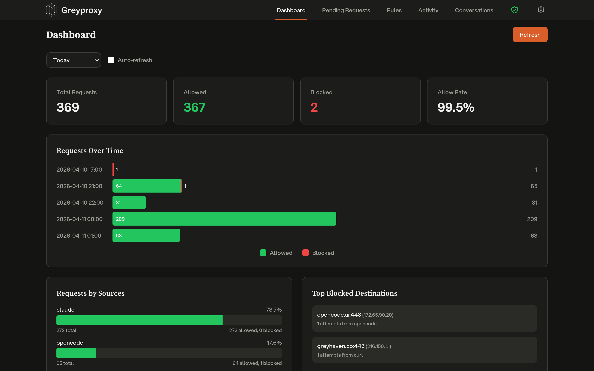

# Dashboard

The Greyproxy dashboard is available at [http://localhost:43080](http://localhost:43080) once greyproxy is running. It provides a real-time view of proxy traffic and a management interface for rules and pending requests.

## Dashboard Sections

### Overview

The main dashboard view shows a real-time summary of proxy traffic:

- Active connections
- Recent requests
- Traffic statistics

### Pending Requests

When greywall routes traffic through greyproxy with no matching allow rule, requests can be placed in a "pending" state for interactive review. From the Pending Requests view you can:

- **Approve** a pending request, which adds the destination to the allow list
- **Deny** a pending request, which blocks the destination
- See which process or container originated the request

This is especially useful during initial setup when you're building up your allow rules.

### Rules

The Rules section lets you manage the allow/deny policy for outbound traffic:

- Add rules matching by destination hostname, port, or pattern
- View and delete existing rules
- Rules are stored in the SQLite database and persist across restarts

### Activity and Transactions

The Activity section shows a historical record of all proxy traffic, including:

- Timestamp
- Source (container or process)
- Destination
- Decision (allowed, denied, or pending)
- Captured HTTP or WebSocket transaction details when MITM is enabled

Click on an entry to expand the full transaction, including request and response headers and bodies, with sensitive header values automatically redacted.

### Conversations

When greyproxy intercepts LLM API traffic, the Conversations tab shows each session reconstructed into a readable transcript: system prompt, user messages, assistant replies, tool calls, and subagent threads. Sessions are grouped per coding tool (Claude Code, Codex, Aider, OpenCode, Gemini CLI, and others). See [LLM Conversations](./conversations) for details on supported providers and custom endpoints.

### Settings

The Settings tab is where you manage runtime behavior: theme, desktop notifications, HTTPS interception (MITM), conversation tracking, header redaction patterns, LLM endpoint rules, stored global credentials, and active credential sessions. Changes take effect immediately without restarting the service.

## Real-Time Updates

The dashboard uses WebSocket-based live updates, so you don't need to refresh to see new pending requests or rule changes.

## Single Binary

The entire dashboard (HTML, CSS, JavaScript, fonts, and icons) is embedded in the greyproxy binary. There is no separate frontend server to deploy or configure.
