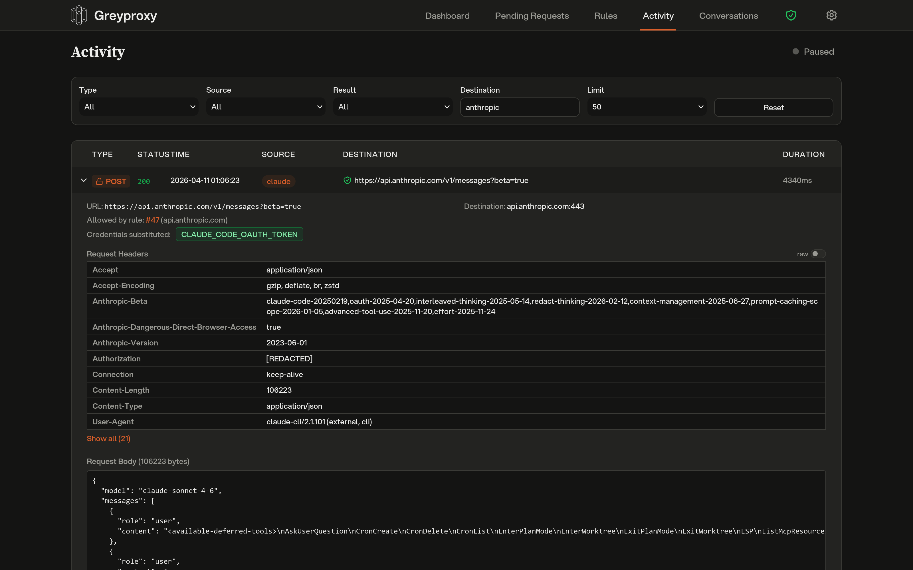

# Sensitive Header Redaction



Greyproxy stores HTTP transactions in its SQLite database for later inspection in the dashboard. To keep credentials out of that database, sensitive header values are replaced with `[REDACTED]` before storage. The original header name is preserved (so you can still tell that an `Authorization` header was present), but the value is gone.

Redaction happens at capture time, before the row is written to disk. Nothing bypasses it, and the database never sees the original value.

## What gets redacted by default

The following patterns are redacted out of the box. Matching is case-insensitive.

| Pattern               | Matches                                        |
|-----------------------|------------------------------------------------|
| `Authorization`       | Bearer tokens, Basic auth, OAuth               |
| `Proxy-Authorization` | Proxy credentials                              |
| `Cookie`              | Session cookies, auth cookies                  |
| `Set-Cookie`          | Response cookies                               |
| `*api-key*`           | `X-Api-Key`, `Anthropic-Api-Key`, and similar  |
| `*token*`             | `X-Auth-Token`, `X-Csrf-Token`, and similar    |
| `*secret*`            | `X-Client-Secret`, and similar                 |

Pattern syntax is simple:

- `Authorization` is an exact match.
- `*word*` matches any header name containing `word`.
- `word*` matches any header name starting with `word`.
- `*word` matches any header name ending with `word`.

## Adding custom patterns

You can add extra redaction patterns via the settings API. Custom patterns are merged with the defaults and persisted to the settings file.

```bash
# Add custom patterns
curl -X PUT http://localhost:43080/api/settings \
  -H 'Content-Type: application/json' \
  -d '{"redactedHeaders": ["*password*", "X-My-Internal-Auth"]}'

# View the full active list (defaults + custom)
curl http://localhost:43080/api/settings | jq .redactedHeaders
```

Only your extra patterns are stored on disk; the default patterns are always applied regardless of what the settings file contains.

## Redacting existing data

If you already have transactions stored from before redaction was enabled (or from before you added a custom pattern), you can run a one-off pass over the database to redact them retroactively.

From the dashboard, open **Settings**, expand **Advanced**, and click **Redact stored headers**. A progress bar shows real-time status.

From the API:

```bash
curl -X POST http://localhost:43080/api/maintenance/redact-headers
```

The job runs in the background, processes transactions in batches, and is idempotent, so it is safe to run more than once. Concurrent runs are rejected with HTTP 409.

## Settings file

Custom patterns are stored in `settings.json` under greyproxy's data directory (typically `~/.local/share/greyproxy/settings.json` on Linux and `~/Library/Application Support/greyproxy/settings.json` on macOS):

```json
{
  "redactedHeaders": ["*password*", "X-My-Internal-Auth"]
}
```
